# PAPER ROCK SCISSORS LIZARD SPOCK - NARUTO STYLE

Naruto - Rock, Paper, Scissor, Lizard, Spock, is a simple, but an extended version of Rock, Paper, Scissor. Much like the name suggests, it is just like the Rock, Paper, Scissor with the addition of Lizard and Spock, but all names have been exchanged to Water, Fire, Wind, Earth and Lightning. 

The game is played by clicking one of the buttons in the middle of the page, the computer will then pick a choice for itself, and a result will be displayed. You can either win, tie or lose a round. The scores will be shown in the scoring area below the buttons. The game will continue for as long as the user chooses to.

Originally I wanted to create a Tic-Tac-Toe website, but in the end, I decided to go for a Rock, Paper, Scissor, Lizard, Spock game instead. Because I had already started working on the Tic-Tac-Toe site I re-used the structure for HTML and CSS from there, to this website, to save a little bit of time.

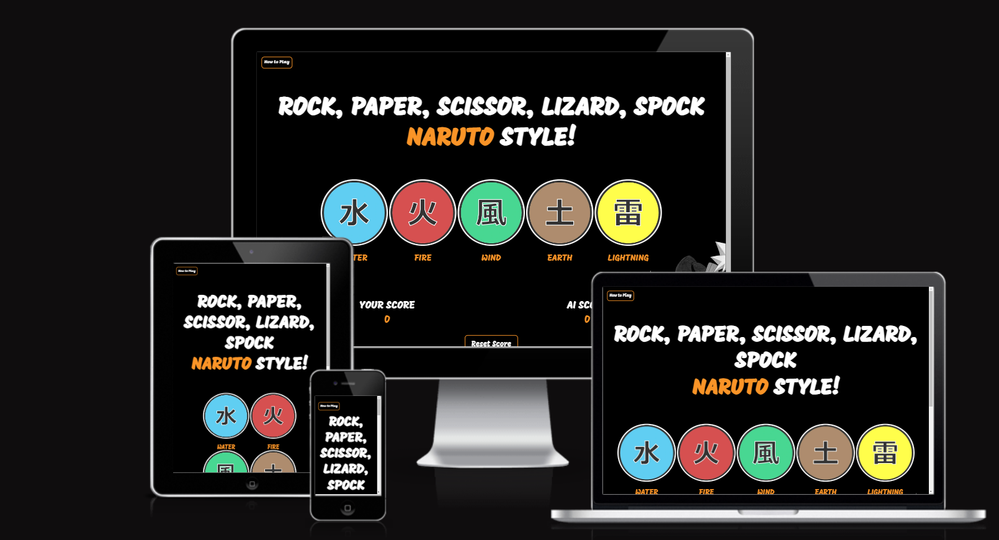

View the live site [here](https://nicolemne.github.io/project-portfolio-2/)

---

## CONTENTS

* [User Experience](#user-experience-ux)
  * [User Stories](#user-stories)

* [Design](#design)
  * [Colour Scheme](#colour-scheme)
  * [Typography](#typography)
  * [Imagery](#imagery)
  * [Wireframes](#wireframes)

* [Features](#features)
  * [General Features on Each Page](#general-features-on-each-page)
  * [Future Implementations](#future-implementations)
  * [Accessibility](#accessibility)

* [Technologies Used](#technologies-used)
  * [Languages Used](#languages-used)
  * [Frameworks, Libraries & Programs Used](#frameworks-libraries--programs-used)

* [Deployment & Local Development](#deployment--local-development)
  * [Deployment](#deployment)
  * [Local Development](#local-development)
    * [How to Fork](#how-to-fork)
    * [How to Clone](#how-to-clone)

* [Testing](#testing)

* [Credits](#credits)
  * [Code Used](#code-used)
  * [Content](#content)
  * [Media](#media)
  * [Acknowledgments](#acknowledgments)

---

## User Experience (UX)

### User Stories

#### Client goals visitors

To be able to view the site and play the game on a range of device sizes.

#### First-time visitors 

I would like a first-time visitor to be curious to test out the game and hopefully have a good time doing so. I'd like to think that a first-time visitor would think that the design and colour scheme is sleek and fun, especially if the visitor is a fan of the Naruto manga or anime series. My goal here is also for the user to enjoy a simple game with a Naruto design and gameplay, and perhaps even recommend it to a friend.

#### Returning visitors 

I hope that the first-time user will enjoy the game enough to want to return and play again. 

## Design

### Finished site
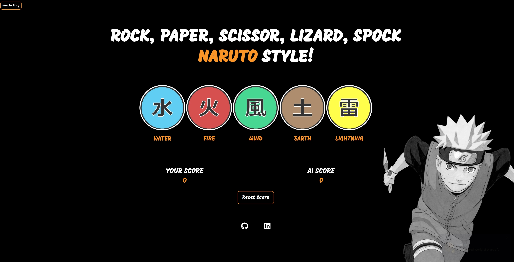

### Colour Scheme

I decided to go with colours that represent Naruto, and the best way to generate them was to take samples from the [Naruto's Official Website.](https://naruto-official.com/en)

.png)

### Typography

I've picked the font 'Mogra' from Google Fonts, which I think has a close resemblance to the Naruto font that is used in the Anime series and Manga. Mogra is used on all text on this website.

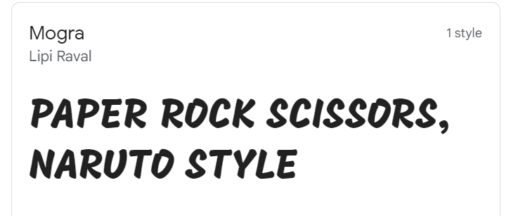

### Imagery

I wanted to have a background image with Naruto (The main character of the Manga and Anime series 'Naruto'). I had to cut out the emblem displayed inside the original image using Paint, to have a full black background to have the elements on top of. 

#### Original Background Image
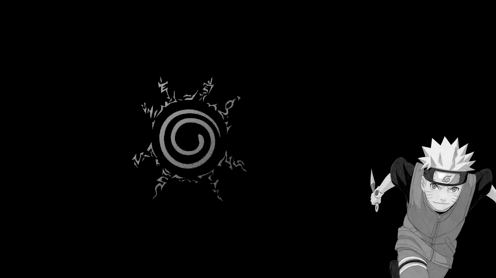

#### Cropped Background Image
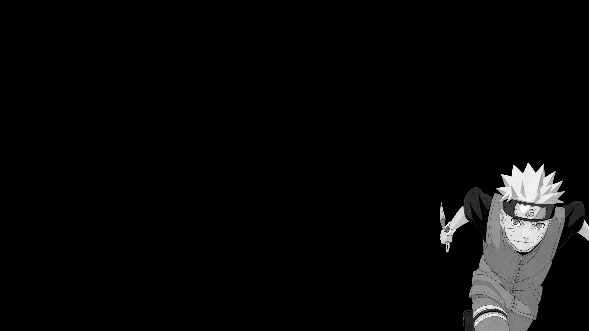

#### Button Images
The button images were borrowed from a Naruto fan wiki website, and to hide the white I decided to display the images with round buttons and borders

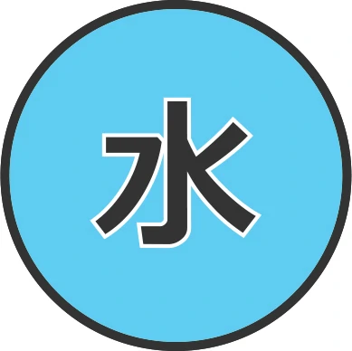
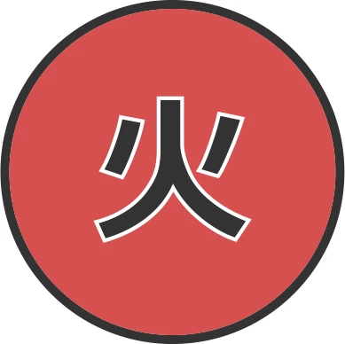
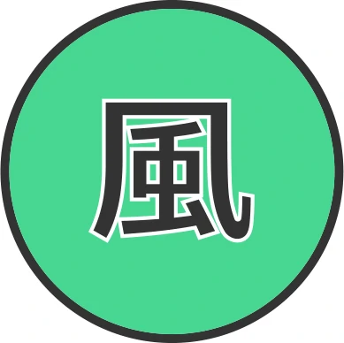
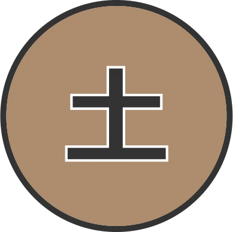
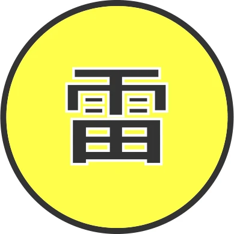

### Wireframes

The wireframes were created using Balsamiq. I wanted to have a simple layout with the game buttons centred in the middle of the page, and the scores and reset button close to the centre for easy view. The "How to Play" button is a little bit more discrete and I chose to have it in the upper left corner. 

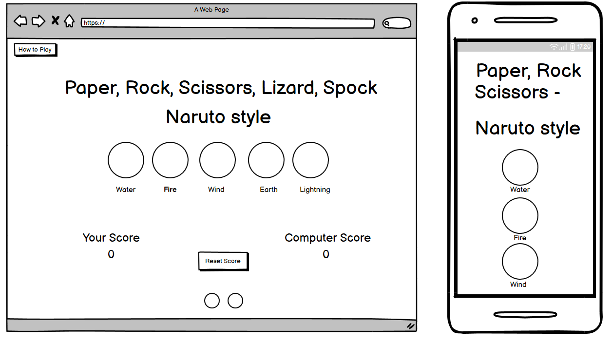

## Features

My website consists of only one page, and features the following: 

### How to Play button that displays an alert
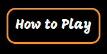

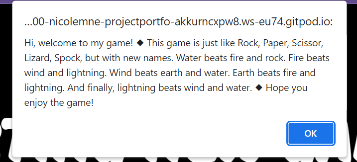

#### When you enter the website the first text will be a short line describing the game
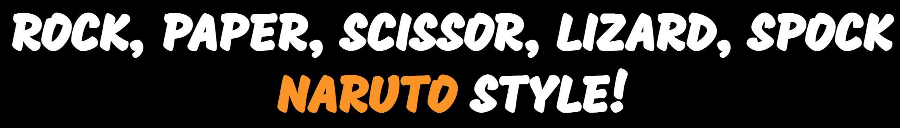

#### 5 buttons to play
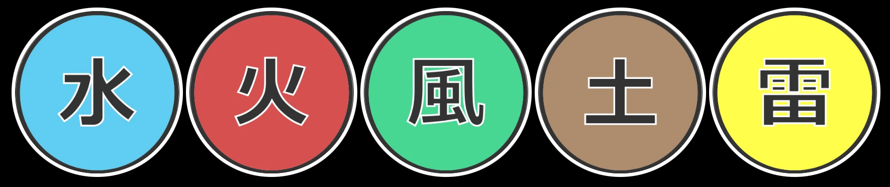

#### When you win a game, the text displays your win
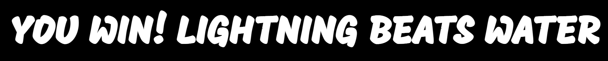

#### Or, when you lose a game
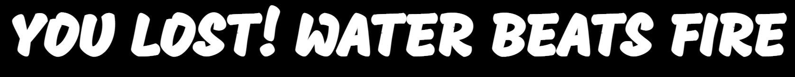

#### The text also changes when you reset your score and start a new game
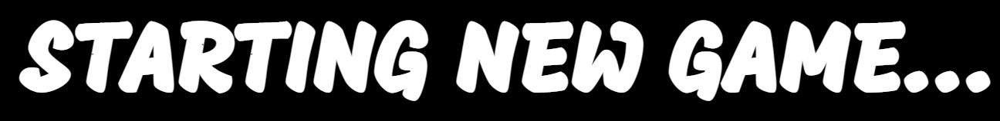

#### The website has a score area to keep track of your and your computer's wins
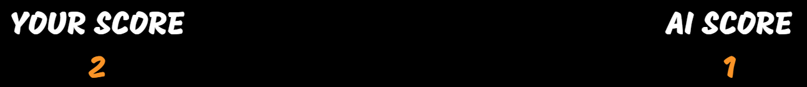

#### A button to reset your and the computer's score
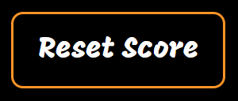

#### Links to my GitHub and LinkedIn

#### Finished site

### Future Implementations

I would like to add more code that works with the Local Storage so that a score area will be displayed where you can keep track of your wins. If this was implemented, I would also add a function that tracks how many rounds you've played, and ends the game after a certain amount of runs.

### Accessibility

I have tried my best to be mindful of accessibility, and the steps I've taken for this are the following:

- Aria labels to the social media links
- Chose a good colour contrast throughout the website
- Semantic HTML

## Technologies Used

- https://www.remove.bg/
- https://rgbacolorpicker.com/
- https://coolors.co/

### Languages Used

The languages I've used are HTML, CSS and JavaScript. 

### Frameworks, Libraries & Programs Used

- [Balsamiq](https://balsamiq.com/) - Used to create wireframes.

- [Github](https://github.com/) - To save and store the files for the website.

- [GitPod](https://gitpod.io/workspaces) - IDE used to create the site.

- [Google Fonts](https://fonts.google.com/) - To import the fonts used on the website.

- [Google Developer Tools](https://www.google.com/chrome/dev/) - To troubleshoot and test features, and solve issues with responsiveness and styling.

- [Favicon.io](https://favicon.io/) To create favicon.

- [Am I Responsive?](https://ui.dev/amiresponsive?url=https://nicolemne.github.io/project-portfolio-2/) To show the website image on a range of devices.

- [Webpage Spell-Check](https://chrome.google.com/webstore/detail/grammarly-grammar-checker/kbfnbcaeplbcioakkpcpgfkobkghlhen) - a google chrome extension that allows you to spell check your webpage. Used to check the site and the readme for spelling errors.

## Deployment & Local Development

### Deployment

#### GitHub Pages

The project was deployed to GitHub Pages using the following steps...

1. Login to GitHub and locate the [GitHub Repository for project-portfolio-2](https://github.com/nicolemne/project-portfolio-2)
2. At the top of the Repository (not the top of the page), locate the "Settings" Button on the menu.
3. In the sidebar menu, click "Pages" in the section "Code and automation".
4. Under "Branch", click "Select branch" and pick "main". Save. 
5. After a few minutes the site link has been published on the top of GitHub Pages.
6. Click the [link](https://nicolemne.github.io/project-portfolio-2/) to see the live site.

### Local Development

#### How to Fork

To fork my repository:

1. Login (or sign up) to GitHub.
2. Go to the repository for this project [here](https://github.com/nicolemne/project-portfolio-2)
3. Click the Fork button in the top right corner.

#### How to Clone

If you wish to clone my project, please see the following steps below:

Navigate to Github: https://github.com/nicolemne/project-portfolio-2
Select the 'Clone' button
Copy the URL or download it as a ZIP file
Use git clone + the URL in your terminal, or unpack the ZIP containing the project

## Testing

### Lighthouse

My website has been Lighthouse tested, please see the score in the image below.

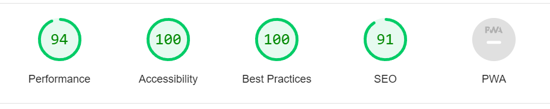

### W3C HTML Validator

I've run the page in the [W3C Markup Validation Service](https://validator.w3.org/) and no errors were found.
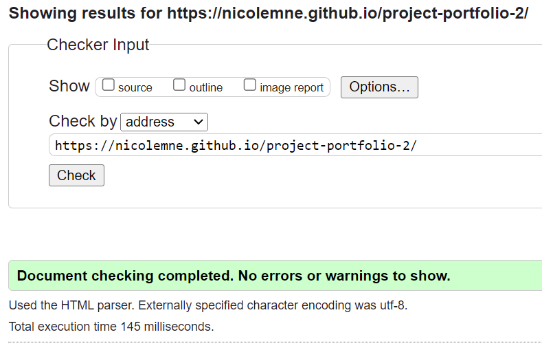 

### W3C CSS Validator

I've run the page in the [W3C CSS Validation Service](https://jigsaw.w3.org/css-validator/) and no errors were found.
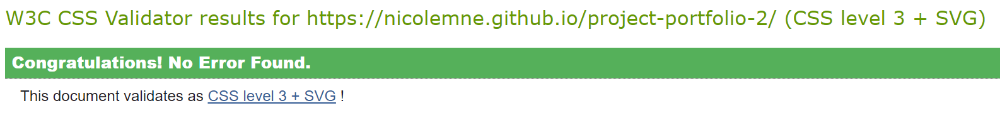 

### Known bugs

The background image does not fill up the screen when you start the game and the #game-text changes.

### Solved Bugs

I've encountered several bugs on the journey of making this website, and most of them I've corrected by seeking help online or from my mentor Mitko. 

Some bugs I've encountered and fixed: 

+ Background Image
  + Description: Background image placement
  + Expected behaviour: Cover full screen
  + Actual behaviour: Not showing up
  + Fix: background-position: center; and background-size: cover;

+ Script not running
  + Description: Javascript not working
  + Expected behaviour: Run in the browser to play game
  + Actual behaviour: Nothing happening
  + Fix: Correct variable names that were written wrong

+ Wrong game message
  + Description: "Starting New Game" randomly appearing
  + Expected behaviour: Only shown when resetting scores
  + Actual behaviour: Randomly appearing in the game message announcer
  + Fix: Set the correct name of the variable in winCombos

## Credits

### Code Used

[Transparent Button](https://www.geeksforgeeks.org/how-to-create-a-transparent-button-using-html-and-css/)

[Z-index not working](https://coder-coder.com/z-index-isnt-working/)

[Guide to Flexbox](https://css-tricks.com/snippets/css/a-guide-to-flexbox/)

[JavaScript Alert](https://www.w3schools.com/jsref/met_win_alert.asp)

### Content

I have written all content on this website. 

I have had some inspiration from the Love maths project, as well as [Carinaa](https://carinaaj.github.io/p2-rock-paper-scissors/) and [Emelie.](https://emeliehansson.github.io/milestone-pp2-rock-paper-scissor/)

###  Media

I do not own any rights to the images used on this website. Please see the links below to where they have been borrowed from.

The images of the water, fire, wind, rock, lightning and water were borrowed from [Naruto Fandom Wiki.](https://naruto-mighty-official.fandom.com/wiki/Naruto_Mighty_Official_Wikia)

The background image was borrowed from [Alpha Coders (Wallpapers).](https://wall.alphacoders.com/big.php?i=1010788)
  
###  Acknowledgments

I would like to thank and acknowledge the following people, who have shown invaluable support throughout my second project:

- Dan Ford, boyfriend and biggest supporter.
- Mitko Bachvarov, my mentor at Code Institute, for the great help and support with my project. 
- Joseph Doble, for providing easy-to-understand explanations and help with my questions.
- Emelie, a fellow student at Code Institute, whom I've also had great support from.
- Kera Cudmore, for this README template.